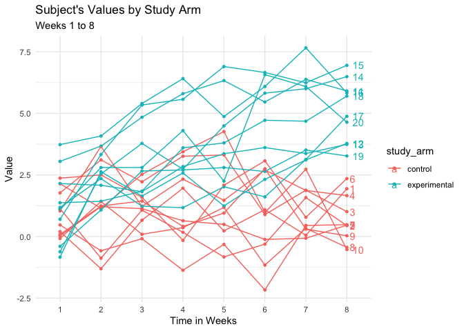

p8105\_hw5\_cq2207
================
Carolina Q Cardoso
11/7/2019

``` r
library(tidyverse)
```

    ## ── Attaching packages ─────────────────────────────────────────────────────────── tidyverse 1.2.1 ──

    ## ✔ ggplot2 3.2.1     ✔ purrr   0.3.2
    ## ✔ tibble  2.1.3     ✔ dplyr   0.8.3
    ## ✔ tidyr   1.0.0     ✔ stringr 1.4.0
    ## ✔ readr   1.3.1     ✔ forcats 0.4.0

    ## ── Conflicts ────────────────────────────────────────────────────────────── tidyverse_conflicts() ──
    ## ✖ dplyr::filter() masks stats::filter()
    ## ✖ dplyr::lag()    masks stats::lag()

``` r
library(rvest)
```

    ## Loading required package: xml2

    ## 
    ## Attaching package: 'rvest'

    ## The following object is masked from 'package:purrr':
    ## 
    ##     pluck

    ## The following object is masked from 'package:readr':
    ## 
    ##     guess_encoding

``` r
library(ggplot2)

set.seed(10)

iris_with_missing = iris %>% 
  map_df(~replace(.x, sample(1:150, 20), NA)) %>%
  mutate(Species = as.character(Species)) %>%
  janitor::clean_names()
```

# Problem 1

Write a function that takes a vector as an argument; replaces missing
values using the rules defined above; and returns the resulting vector.
Apply this function to the columns of iris\_with\_missing using a map
statement.

``` r
#For numeric variables, you should fill in missing values with the mean of non-missing values
#For character variables, you should fill in missing values with "virginica" (Species)

fx_fill = function(x) {
  
  if (is.numeric(x))  {
    replace_na(x, mean(x, na.rm = TRUE))
  }
  
  else if (is.character(x)) {
    replace_na(x, "virginica")
  }
  
}

iris_filled = map(iris_with_missing, fx_fill) %>%
  as_tibble()
```

# Problem 2

``` r
prob2_data =
  list.files("./datasets/", pattern = ".csv", full.names = TRUE) 

data_complete = prob2_data %>%
  map_df(read.csv) %>%
  mutate(file_name = tools::file_path_sans_ext(basename(prob2_data))) %>%
  mutate(
    subject_id = c(1:20), 
    study_arm = ifelse(subject_id == c(1:10), "control", "experimental")
  ) %>%
 select(subject_id, study_arm, file_name, everything()) %>%
 select(-file_name) %>% #used name of file to ensure observations were coded correctly as control/experimental 
pivot_longer(week_1:week_8, names_to = "week", names_prefix = "week_", values_to = "value")
 

data_complete %>%
  ggplot(aes(x = week, y = value, color = study_arm, group = subject_id)) +
  geom_point(size = 1) + geom_line() +
  geom_text(data = subset(data_complete, week == "8"), aes(label = subject_id, x = week, y = value), hjust = -.5) +
  labs(
    title = "Subject's Values by Study Arm",
    subtitle = "Weeks 1 to 8",
    x = "Time in Weeks",
    y = "Value")
```

<!-- -->

While both the control and the experimental arms of the study varied
through out the 8 weeks, the experimental arm showed a net increase in
value, and finished Week 8 with higher values than the control arm and
higehr values than at baseline (Week 1).

# Problem 3

1)  First set the following design elements:

<!-- end list -->

  - Fix n=30
  - Fix xi1 as draws from a standard Normal distribution
  - Fix β0=2
  - Fix σ2=50

<!-- end list -->

2)  Set β1=0. Generate 10000 datasets from the model

<!-- end list -->

``` r
set.seed(10)

sim_regression = function(beta1, n = 30, beta0 = 2) {
  
  sim_data = tibble(
    x = rnorm(n, mean = 0, sd = 1),
    y = beta0 + beta1 * x + rnorm(n, mean = 0, sd = 50^(.5))
  )
  
  ls_fit = lm(y ~ x, data = sim_data) %>% broom::tidy()
  
  tibble(
    beta1_hat = ls_fit[[2,2]],
    p_value = ls_fit[[2,5]]
  )
}


sim_results = 
  rerun(10000, sim_regression(beta1=0)) %>% 
  bind_rows() 

sim_results
```

    ## # A tibble: 10,000 x 2
    ##    beta1_hat p_value
    ##        <dbl>   <dbl>
    ##  1    -2.44   0.0895
    ##  2    -0.366  0.769 
    ##  3     2.10   0.0917
    ##  4    -0.963  0.431 
    ##  5     1.61   0.192 
    ##  6     0.213  0.880 
    ##  7    -1.99   0.219 
    ##  8     2.15   0.252 
    ##  9     0.421  0.773 
    ## 10     0.685  0.532 
    ## # … with 9,990 more rows

3)  Repeat the above for β1={1,2,3,4,5,6}
